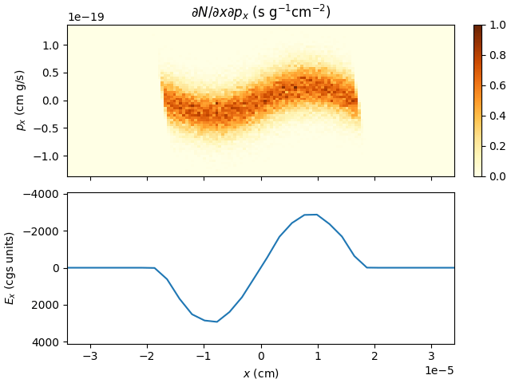

<p align="center">

</p>

$\pi$-PIC (PIPIC, Python-controlled Interactive PIC) is an open-source collection of relativistic particle-in-cell solvers featuring
- exact energy conservation;
- absence of numerical dispersion.

The solvers provide a way to eliminate or suppress numerical artefacts (instabilities, heating, numerical Cherenkov radiation, etc.) permitting larger space and time steps, as well as lower number of particles per cell.
Because of reduced computational demands, the solvers can be found useful for quick tests of ideas, as well as for scanning parameter spaces. For the description of underlying methods see https://arxiv.org/abs/2302.01893.

---

Contact: arkady.gonoskov@physics.gu.se

# Overview
$\pi$-PIC provides all tools necessary for designing simulations and arbitrary outputs directly from Python. In addition, it has interfaces for incorporating extensions (read/modify field and particles, add/remove particles) that can be developed in Python, C/C++, Fortran or any other language that generate callable functions. To get started one can:
- [Use a precompiled module](https://github.com/hi-chi/pipic/releases/)
- [Compile a module yourself](#code-compilation)

The basic layout of use includes five elements: 
- creating a container with cells with given parameters
- adding particles of all necessary types
- setting initial electromagnetic field
- defining output (via loops over particles and grid values of field)
- advance and read the state of the defined physical system

Below we demonstrate the use of these elements in a simple [example](examples). A complete list of supported interfaces can be found [here](docs/interfaces.md). The development of extensions is detailed and exemplified [here](docs/making_extentions.md). 

# Code compilation

$\pi$-PIC has been tested and confirmed to work Linux / macOS / Windows under [`WSL`](learn.microsoft.com/windows/wsl/about). Installation requirements are:
- Python 3
- [`gcc`](https://gcc.gnu.org/)
- [`fftw3`](http://www.fftw.org/) (`gcc` and `fftw3` must be both of 64-bit format)
- [`openmp`](https://www.openmp.org/)
- [`pybind11`](https://github.com/pybind/pybind11) (handled automatically when installed through `pip`)

Furthermore, the following python packages are generally needed for running the code:
- [`numba`](https://numba.pydata.org/)
- [`numpy`](https://numpy.org/)

## PyPI
$\pi$-PIC is available through PyPI and is the recommended installation method:
```
pip install pipic
```
If using a non-standard compiler (for example using gcc installed through homebrew on macOS) this can be specified as:
```
CC=<c-compiler> CXX=<c++-compiler> pip install pipic
```

## CMake
As an alternative, manual compilation is also available using `cmake`. This extends the above requirements to also include:
- [`CMake`](https://cmake.org/) 3.1 or higher

To compile:
- Clone the repository
    ```
    git clone https://github.com/hi-chi/pipic.git
    ```
- Go to `src` folder and fetch `pybind11`:
    ```
    cd pipic/src
    git clone https://github.com/pybind/pybind11
    ```
- Generate binary .so-file by running sequentially:
    ```
    cmake .
    make
    ```
- To use compilers other than default, set the `CC` and `CXX` environment variables prior to running `cmake`, or pass the compilers as arguments to `cmake` using the `-DCMAKE_C_COMPILER=` and `-DCMAKE_CXX_COMPILER=` flags.

To use $\pi$-PIC requires that both the `pipic/` subfolder (python package) and the `_pipic.*.so` binary (C/C++ package) are present in your project folder or otherwise made available, e.g. through your `$PATH`.

# Example

To use $\pi$-PIC, follow one of the installation paths above. Then, write your own Python script that describes your simulation setup (you can create or modify one of the [examples](examples)).

After placing all of the necessary files in your project folder you can import the $\pi$-PIC package as:
```
import pipic
from pipic import consts, types
import matplotlib.pyplot as plt
import numpy as np
from numba import cfunc, carray
```
Next we define main parameters and create an empty container for particles (this also allocates the grid for electromagnetic field):
```
temperature = 1e-6 * consts.electron_mass * consts.light_velocity**2
density = 1e+18
debye_length = np.sqrt(temperature / (4*np.pi * density * consts.electron_charge**2))
plasma_period = np.sqrt(np.pi * consts.electron_mass / (density * consts.electron_charge**2))
l = 128*debye_length
xmin, xmax = -l/2, l/2
field_amplitude = 0.01*4*np.pi * (xmax-xmin) * consts.electron_charge * density
nx = 128
time_step = plasma_period/64
sim = pipic.init(solver='ec', nx=nx, xmin=xmin, xmax=xmax)
```
Here we instruct the container to use first-order energy-conserving solver and allocate 1D region (one can initiate 2D and 3D geomety by specifying `ny, nz, ymin, ymax, zmin, zmax` in the parameter line).
> [!NOTE]
> Note that all physical quantities are in CGS units.

To add particles one first defines the density as a function of coordinate ($x=$ `r[0]`) and then passes the function address to the container together with other necessary parameters. In the following example, we define particle type with name `electron`, charge `-electron_charge` and mass `electron_mass`, and then distribute `sim.nx*50` macriparticles to achieve uniform density `Density` within region $x \in $`[L/4, L/4`] at temperature `temperature` (two-thirds of the average kinetic energy). Assuming `xmax=-xmin=L/2` this corresponds to 100 particles per cell (ppc) on average.   
```
@cfunc(types.add_particles_callback)
def density_callback(r, data_double, data_int):
    return density * (abs(r[0]) < l/4)

sim.add_particles(name='electron', number=500*nx,
                  charge=-consts.electron_charge, mass=consts.electron_mass,
                  temperature=temperature, density=density_callback.address)
``` 
The algorithm of function can include mathematical functions and most of the programming elements within functionality of `numba` callbacks (see https://numba.readthedocs.io/en/stable/user/cfunc.html). Note that one can use global variables defined earlier, but their later change within Python routines will not take effect for the function. To communicate data between callback environment and Python environment one can pass address to allocated data blocks of double or integer type, `data_double` and `data_int`, respectively.

To set the initial state of electromagnetic field one defines and pass to container the address to the function that computes the field for a given point of space. Indices `[0]`, `[1]` and `[2]` correspond to $x$, $y$ and $z$, respectively). In the following example, we assign $E_x$ field component in the form of one sinusoidal oscillation with amplitude `field_amplitude` and period `L/2` along $x$ coordinate, other components are set to zero by default:
```
@cfunc(types.field_loop_callback)
def setField_callback(ind, r, E, B, data_double, data_int):
    E[0] = field_amplitude * np.sin(4*np.pi * r[0] / (xmax-xmin)) * (abs(r[0]) < l/4)

sim.field_loop(handler=setField_callback.address)
```
If necessary one can defined field via indices of the grid node (`ind[0]`, `ind[1]` and `ind[2]`). The value of `ind[4]` is allocated to indicate the type of the grid. Currently all grids are of type `0`, which corresponds to collocation of all field components at position $x=$`xmin + ind[0]*(xmax - xmin)/nx`, $y=$`ymin + ind[1]*(ymax - ymin)/ny` and $z=$`zmin + ind[2]*(zmax - zmin)/nz`. The field and distribution of charges unambiguously define (via Poisson's equation) the background distribution of charge that remains fixed throughout the simulation.

Once all the species of particles are added to the container and the field is set, we can define the way we make output, again using callbacks. 

For example, to get the $x-p_x$ distribution of electrons we allocate two-dimensional `numpy` array to be filled, define callback function that details the contribution of macroparticles to respective cells of this array and pass addresses of both to the container for it to run a loop over the specified type of particles:
```
fig, axs = plt.subplots(2, constrained_layout=True)

# -------------preparing output for electron distribution f(x, px)--------------
xpx_dist = np.zeros((64, 128), dtype=np.double)
pxLim = 5 * np.sqrt(temperature * consts.electron_mass)
inv_dx_dpx = (xpx_dist.shape[1] / (xmax-xmin)) * (xpx_dist.shape[0] / (2 * pxLim))

@cfunc(types.particle_loop_callback)
def xpx_callback(r, p, w, id, data_double, data_int):
    ix = int(xpx_dist.shape[1] * (r[0] - xmin) / (xmax-xmin))
    iy = int(xpx_dist.shape[0] * 0.5 * (1 + p[0] / pxLim))
    data = carray(data_double, xpx_dist.shape, dtype=np.double)
    if iy >= 0 and iy < xpx_dist.shape[0]:
        data[iy, ix] += w[0] * inv_dx_dpx / (3*density/pxLim)

axs[0].set_title('$\partial N / \partial x \partial p_x$ (s g$^{-1}$cm$^{-2}$)')
axs[0].set(ylabel='$p_x$ (cm g/s)')
axs[0].xaxis.set_ticklabels([])
plot0 = axs[0].imshow(xpx_dist, vmin=0, vmax=1,
                      extent=[xmin, xmax, -pxLim, pxLim], interpolation='none',
                      aspect='auto', cmap='YlOrBr')
fig.colorbar(plot0, ax=axs[0], location='right')

def plot_xpx():
    xpx_dist.fill(0)
    sim.particle_loop(name='electron', handler=xpx_callback.address,
                      data_double=pipic.addressof(xpx_dist))
    plot0.set_data(xpx_dist)
```
The state of electromagnetic field can be retrieved by making a loop over all grid nodes using previously mentioned function `field_loop()`. However, to make a loop through a subset of locations one can use a different function `custom_field_loop()` that offers a possibility to define an arbitrary set of points for the field interpolation. To do so one needs to introduce two callback functions: the first function defines the location for a give element of subset `it[0]` and the second function defines how the electromagnetic field at this locations contribute to the output. The addresses of these functions are passed to the container together with the size of subset `number_of_iterations`, i.e. `it[0]` will be varied from `0` to `number_of_iterations - 1`. In the following example we apply the routine to fetch $E_x$ as a function of $x$ at 32 locations:
```
Ex = np.zeros((32,), dtype=np.double)

@cfunc(types.it2r_callback)
def Ex_it2r(it, r, data_double, data_int):
    r[0] = xmin + (it[0] + 0.5) * (xmax-xmin) / Ex.shape[0]

@cfunc(types.field2data_callback)
def get_Ex(it, r, E, B, data_double, data_int):
    data_double[it[0]] = E[0]

axs[1].set_xlim([xmin, xmax])
axs[1].set_ylim([-field_amplitude, field_amplitude])
axs[1].set(xlabel='$x$ (cm)', ylabel='$E_x$ (cgs units)')
x_axis = np.linspace(xmin, xmax, Ex.shape[0])
plot_Ex_, = axs[1].plot(x_axis, Ex)

def plot_Ex():
    sim.custom_field_loop(number_of_iterations=Ex.shape[0], it2r=Ex_it2r.address,
                          field2data=get_Ex.address, data_double=pipic.addressof(Ex))
    plot_Ex_.set_ydata(Ex)
```
We now can advance the state of the system in the container, making output whenever needed:
```
output_folder = 'basic_example_output'
if not os.path.exists(output_folder):
    os.makedirs(output_folder)
time_start = time.time()
for i in range(32):
    sim.advance(time_step=time_step, number_of_iterations=8)
    plot_xpx()
    plot_Ex()
    fig.savefig(output_folder + '/im' + str(i) + '.png')
    print(i, '/', 32)
```
To perform the simulation save this code as [basic_example.py](examples/basic_example.py) and run:
```
python3 basic_example.py
```
The code will produce a sequence of images (takes a few seconds) that can be combined in a movie showing plasma oscillations:

<p align="center">

</p>

This and other examples can be found in [examples](examples). For detailed description of all interfaces see [User interfaces](docs/interfaces.md).

# Reference

A. Gonoskov, Explicit energy-conserving modification of relativistic PIC method, [arXiv:2302.01893](https://arxiv.org/abs/2302.01893) (2023)
